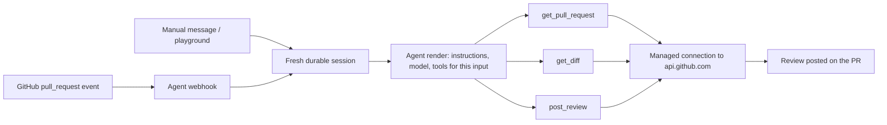

# PR Review Agent

An [OpenComputer Serverless Agent](https://opencomputer.dev) that reviews GitHub
pull requests. When a PR opens or updates, it reads the diff, reviews the change,
and posts a review: inline comments where it is confident, a summary comment
otherwise.

Built from scratch as a real-user exercise. The commit history is deliberately
granular — every step is a small, focused change, so the build is reviewable and
forkable from any point.

## Target behavior

- Triggered by a GitHub `pull_request` event (`opened`, `synchronize`,
  `reopened`), or manually with a PR reference ("review acme/widgets#42").
- Fetches PR metadata and the diff through the GitHub API using an OpenComputer
  managed secret — the token is attached at the platform's outbound edge and
  never enters the agent runtime, prompts, or source.
- Reviews for correctness first: bugs, missed edge cases, broken contracts.
  Style feedback only where the repository states a convention.
- Posts one review per triggering event: inline comments anchored to diff lines
  plus a short verdict summary. Defaults to `COMMENT` — it does not approve or
  request changes unless configured to.
- Dry-run mode (the default until wiring is proven): produce the full review as
  session output without posting anything to GitHub.

## How it works

In Serverless Agents terms:

- `opencomputer/agents/pr-review/agent.ts` default-exports a synchronous render
  function. Per input it selects the model, instructions, and tools — the write
  tool (`post_review`) is only attached when the input asks for a live review.
- `defineConnection` declares the only outbound destination:
  `https://api.github.com`, `GET`/`POST`, path prefix `/repos/`, authorized with
  `bearer(useSecret("GITHUB_TOKEN"))`.
- Code-defined tools fetch PR metadata, the diff, and post the review through
  that connection.
- An agent webhook (operational config, not source) gives GitHub a stable URL;
  each delivery starts a fresh durable session, deduplicated by idempotency key.

## Open questions going in

- GitHub webhook deliveries authenticate with an HMAC signature
  (`X-Hub-Signature-256`) and cannot set an `Authorization: Bearer` header;
  OpenComputer agent webhooks expect a bearer token. Expect either a relay in
  between or a product answer. Resolved in step 7.
- Large PRs: one raw diff may not fit a review turn well; may need per-file
  tools instead of a single `get_diff`.
- Inline comment anchoring (side/line) on the GitHub reviews API is fiddly;
  keep a summary-only fallback.

## Build plan

1. **Sketch** — this README.
2. **Scaffold** — `npx @opencomputer/cli init .`
3. **First deploy** — `npm run deploy -- --watch`, playground smoke test.
4. **Read tools** — GitHub connection + `get_pull_request`, `get_diff`.
5. **Reviewer** — review instructions, dry-run review as session output.
6. **Write tool** — `post_review`, still dry-run by default.
7. **Webhook** — GitHub → agent webhook wiring, idempotent per delivery.
8. **Hardening** — big diffs, `synchronize` re-reviews, failure behavior.

## DX log

Developer-experience observations — friction, gaps, bugs, pleasant surprises —
are recorded in [DX-NOTES.md](DX-NOTES.md) as they happen, from the perspective
of a new user following only the public docs.
